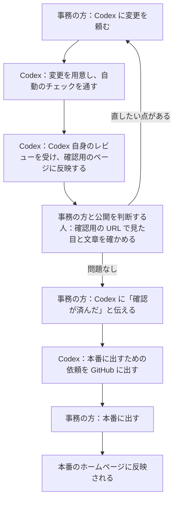

# 村田宝飾 コーポレートサイト

村田宝飾株式会社のホームページ（https://www.murata-jewelry.co.jp ）の中身を置いている場所です。
お知らせの文章、写真、ページの作りがここに入っています。

ホームページを直したいときは、このページを直接いじらず、ChatGPT の Codex に日本語で頼んでください。
Codex が変更を用意し、確認用のページを作って、公開の手前まで進めてくれます。
Git や HTML の知識は要りません。

本番のホームページは、現在 https://murata-corporate-site.pages.dev/ で公開しています。上の https://www.murata-jewelry.co.jp は、まだ旧サイトのままです。
確認用のページの URL は、使い始めるときに大久保から伝えます。

## Codex への頼み方

普段の言葉でそのまま頼めば足ります。たとえば次のように書きます。

- 「お知らせを追加してください。題名は〇〇、日付は今日、本文は次のとおりです。」（公開日の当日に頼む）
- 「トップページの写真を、添付した写真に差し替えてください。」
- 「会社概要の〇〇という文言を△△に直してください。」
- 「確認が済んだので、本番に出したいです。」
- 「本番にリリースして。」

頼むときは、次の情報を添えると作業が早く進みます。

- お知らせの題名
- お知らせの日付（公開日）
- 本文
- 使う写真（ファイルを添付し、何を写した写真かも書く）
- いつ公開したいか

分からない点があれば、Codex が作業を始める前に質問します。
「本番にリリースして」のように、本番に出すことをはっきり頼んだときだけ、Codex は本番へ出す作業をします。

## 公開までの流れ

変更はすぐ本番（誰でも見られるホームページ）には出ません。
まず確認用のページに出し、人が確かめて、問題がなければ本番に出します。

人がやることは次のとおりです。

- 確認用の URL で、変更が意図どおりかを事務の方と公開を判断する人が確かめる。確認用の URL は大久保から伝える。確認用のページは、今は Cloudflare Access のログイン画面で閲覧が制限されている。大久保が Access を外す予定で、外したあとは閲覧の制限が無くなり、検索には載らないが、URL を知っている人は誰でも見られる。外すまでは、確認用の URL を開くとログインを求められる
- 公開を判断する人が、本番に出してよいと決める
- 本番に出す。GitHub の画面で「Merge pull request」を押すか、Codex に「本番にリリースして」と頼む。頼まれた Codex は、本番に出る内容を見せたうえで「はい」の返事を待ち、それから出す

Codex がやることは次のとおりです。

- 変更を用意し、自動のチェック（ビルド、画面の動作、パスワードらしき文字列の混入など）を通す
- 変更の内容を `@codex review` というコメントで Codex にレビューしてもらい、指摘を直す
- 確認用のページに反映し、確かめるよう伝える
- 確認が済んだと言われたら、同じ変更を本番に出す手続きに進める

本番に出すと、作業用に使った枝（変更を分けて管理する単位）は自動で消えます。

## 自分で出せるもの、大久保の確認が要るもの、大久保に頼むもの

Codex は、頼まれた内容をまず3つに分けて、どれに当たるかを伝えます。

| 区分 | 内容 | 本番に出すとき |
| --- | --- | --- |
| A：内容の更新 | お知らせの追加と修正、写真の差し替え、お知らせの文言 | 自動のチェックがすべて通れば、事務の方が自分で出せる |
| B：見た目と構成の変更 | レイアウト、新しいページ、部品、色や文字、ページ内の文言 | 事務の方が自分で出せる。ただし、ほかのページに影響しうるので、Codex が挙げた「影響するページ」をすべて確かめてから出す（下の「見た目や構成を変えたときの確かめ方」） |
| C：それ以外 | 設定、仕組み、AI のルール、プライバシーポリシー、エントリーフォーム、全ページ共通の head など | 事務の方の依頼では、Codex は扱わない。大久保へ連絡する。大久保と、このリポジトリに招待されたデザイナーは扱える（必須チェックは通す） |

区分が分からない依頼は、C として扱って作業を止めます。

### 見た目や構成を変えたときの確かめ方

区分 B の変更は、直したページ以外にも影響することがあります。たとえばヘッダーやフッター、色を変えると、全ページが変わります。そのため、次のように確かめてから本番に出してください。

1. Codex が、変更依頼の画面の「影響するページ」に、確かめるページを挙げる
2. 挙がったページをすべて、確認用の URL で開く。PC とスマートフォンの両方で見る
3. 本番のホームページと見比べて、頼んだ箇所が意図どおりに変わっていること、頼んでいない箇所が変わっていないことを確かめる
4. 確かめ終えたら、Codex に「影響するページをすべて確かめた」と伝える

トップページからリンクでたどれるページが開くか、ヘッダーとフッターとメニューにあるサイト内のリンク先があるか、メニューが動くか、エントリーフォームの入力チェックが働くかといった全体の動作は、自動のチェックが毎回確かめています。どこからもリンクしていない新しいページや、見た目の細かな崩れは自動では見つけられないので、上の確かめ方で人が見ます。

## デザイナーの方へ

外部のデザイナーの方は、GitHub で **Write 権限**の collaborator として大久保から招待されます（個人のリポジトリには権限の段階が無く、招待された人は全員この権限になります）。
招待された人は、区分 C を含めて、このリポジトリのほぼすべてを変えられます。
ただし、必須チェック（`build`、`playwright`、`scope`、`staging-verified`、`secrets`、`codex-review`）は通す必要があります。
招待されていない人が fork から出した PR は、区分 C を含むと `scope` が失敗して止まります。
デザイナーの区分 C の PR は、デザイナー本人が GitHub の画面で「Merge pull request」を押します。

なお、招待された人は全員、区分 C を変えられます。
区分 C を任せると、自動のチェックの定義そのものも書き換えられるので、必須チェックが防げるのはうっかりしたミスまでです。
悪意ある変更や、乗っ取られたアカウントは防げません。
招待は、デザイナーを信頼できる場合に限ります。

作業の環境は、ChatGPT の Codex の Web 版です。
アカウントの作り方、招待の受け方、Codex の準備、本番に出すまでの手順は [docs/designer-guide.md](docs/designer-guide.md) にあります。
作業の流れの規則は [AGENTS.md](AGENTS.md) に従います。

このリポジトリは公開されているので、公開日前の情報、顧客や取引先の名前、個人情報、社内の資料を入れないでください。
Figma のリンクや、Figma にある未公開の文言も入れないでください（[AGENTS.md](AGENTS.md) の「Figma のデザインを実装するとき」を参照）。

## リポジトリに入れてはいけないもの

このリポジトリは公開されていて、誰でも中身と変更の履歴を読めます。
一度入れた情報は、あとから消しても履歴に残ります。
次のものは、Codex への依頼文にも添付ファイルにも含めないでください。

- 公開日前に知られると困る情報（新作、イベント、採用計画、価格の改定など）。下書きにしても読めてしまうので、公開日になってから入れる
- 顧客や取引先の名前、個人情報（本人や先方の了承があるものを除く）
- 卸価格や取引条件など、TJC（会員向けのネットショップ）の会員向けの情報
- 社内の資料、パスワード、API キー

依頼にこれらが含まれていると、Codex は作業を止めて知らせます。

## 困ったとき

誤って公開してしまったときは、自分や Codex で直そうとせず、すぐに大久保へ連絡してください。
大久保が Cloudflare で公開を元の状態に戻します。
大久保向けの手順は [docs/procedures/rollback.md](docs/procedures/rollback.md) にあります。

次の場合も、大久保へ連絡してください。

- Codex が「大久保へ連絡してください」と言ったとき（作業の食い違いが起きた、自動のチェックが2回直しても通らない、区分の判断がつかない、など）
- 自動のチェックが赤いまま進まないとき。チェックの結果は、GitHub の変更依頼の画面の下のほうに並んでいる
- Codex のレビューがいつまでも付かないとき。まず、GitHub の変更依頼の画面の下にあるコメント欄に `@codex review` と書いて送る。それでも付かなければ連絡する

連絡のとき、何をしていて、画面や Codex の返事がどうなったかを添えてもらえると、原因をつかみやすくなります。

## 大久保と AI 向けの資料

- [docs/development.md](docs/development.md)：手元での動かし方、公開の仕組み、必須チェック、GitHub と Cloudflare の設定
- [docs/designer-guide.md](docs/designer-guide.md)：デザイナー向けの始め方（GitHub と Codex の準備から本番に出すまで）
- [AGENTS.md](AGENTS.md)：このリポジトリで作業する AI のルール
- [docs/procedures/](docs/procedures/)：お知らせの追加、写真の差し替えなど、定型作業の手順書
