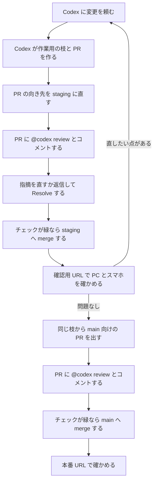

# デザイナー向け 始め方

村田宝飾のコーポレートサイトを、デザイナーの方が自分で変えて本番に出すまでの手順です。
Git の知識は要りません。
画面のボタン名は、GitHub と ChatGPT の表示に合わせて英語のまま「」で示します。

手順のうち、実際に試して確かめていないものには「未検証」と書いてあります。
うまくいかなければ、大久保へ連絡してください。
最後の「10. 未検証の点」に一覧があります。

## 1. 全体像

デザイナーの方は、GitHub で **Write 権限**の collaborator として大久保から招待されます。
個人のリポジトリには権限の段階が無いので、招待された人は全員この権限になります。
この権限があると、レイアウトや色などの見た目（区分 B）に加えて、設定やプライバシーポリシーなど区分 C のファイルも変えられます。
ただし、区分 C を変えても、自動の必須チェックはすべて通す必要があります。
通れば、本番に出せます。大久保の承認を求める設定（ruleset `main-review`）は、大久保が無効にする予定です。まだ有効なあいだは、区分 C を含む PR は大久保の承認待ちで止まります。
区分 C の PR は、デザイナー本人が GitHub の画面で「Merge pull request」を押します。

区分 C を任せると、自動のチェックの定義そのものも書き換えられます。
必須チェックが防げるのはうっかりしたミスまでなので、アカウントの管理には気を付けてください。
また、事務の方の依頼を、デザイナーの認証で代行して出さないでください。

作業は ChatGPT の Codex の Web 版（https://chatgpt.com/codex ）で行います。
Codex に日本語で頼むと、Codex が変更を作り、GitHub に変更依頼（PR）を出します。
PR は「この変更を取り込んでください」という依頼の画面です。

変更はすぐ本番には出ません。
先に確認用のページ（staging）に出して確かめ、問題がなければ本番（main）に出します。



このリポジトリは公開されていて、誰でも中身と変更の履歴を読めます。
一度入れた情報は、あとから消しても履歴に残ります。
次のものは、Codex への依頼文にも、添付ファイルにも、PR のコメントにも書かないでください。

- 公開日前に知られると困る情報（新作、イベント、採用計画、価格の改定など）
- 顧客や取引先の名前、個人情報（本人や先方の了承があるものを除く）
- 卸価格や取引条件など、TJC（会員向けのネットショップ）の会員向けの情報
- 社内の資料、パスワード、API キー
- Figma のファイルのリンク、フレームの ID、Figma にある未公開の文言

本番のホームページは、現在 https://murata-corporate-site.pages.dev/ です。
https://www.murata-jewelry.co.jp は、まだ旧サイトのままです。

## 2. GitHub のアカウントを作る

すでに GitHub のアカウントがある場合は、手順 5 まで飛ばして、ユーザー名を大久保に伝えてください。

1. https://github.com/signup を開く
2. メールアドレス、パスワード、ユーザー名を入力して画面の案内に進む。ユーザー名は、あとから変えると招待や履歴の表示に影響することがあるので、仕事で使い続けてよい名前にする。本名や会社名が分かる名前だと、大久保が本人と確認しやすい
3. メールに届く確認コードを入力して、メールアドレスを確認する
4. 設定の「Password and authentication」から、二段階認証（Two-factor authentication）を有効にする。Write 権限はサイトの大部分を変えられるので、有効にすることを強く勧めます
5. 自分のユーザー名を大久保に伝える。招待は、このユーザー名宛てに送られます

## 3. 招待を受ける

1. 大久保が招待を送ると、GitHub に登録したメールアドレスに招待メールが届く。メールの「View invitation」から開く
2. メールが見つからないときは、https://github.com/kotaokubo/murata-corporate-site/invitations を開く（GitHub にログインした状態で開く）
3. 画面の「Accept invitation」を押す
4. 招待の有効期限は7日です。過ぎて開けなくなったら、大久保に招待のやり直しを頼む
5. 受けたあと、https://github.com/kotaokubo/murata-corporate-site を開き、リポジトリの画面が表示されることを確かめる。「Pull requests」タブが見えれば、リポジトリへのアクセスが付いています（個人のリポジトリでは、招待された人に「Settings」タブは出ません）

## 4. ChatGPT と Codex を準備する

1. ChatGPT のアカウントを用意する。すでにあればそれを使う
2. Codex が使えるプランに入っていることを確かめる。有料プランが要る見込みですが、必要なプランは変わることがあります。最新の条件は OpenAI のヘルプで確認してください（未検証）
3. https://chatgpt.com/codex を開く
4. 画面の案内に従って GitHub を接続する。GitHub の許可画面が出たら、内容を確かめて許可する
5. 環境（environment）を作る画面で、リポジトリに `kotaokubo/murata-corporate-site` を選ぶ。選択肢に出てこないときは、手順 3 の招待を受けていること、GitHub の接続でこのリポジトリが許可されていることを確かめる。それでも出ないときは大久保へ連絡する（未検証）
6. Node.js のバージョンは 22 を選ぶ
7. セットアップ用のスクリプトの欄に、次の2行を入れる。2行目を飛ばすと、のちの画面の動作確認（`npm run test:e2e`）がブラウザ無しで失敗します

```sh
npm ci
npx playwright install --with-deps chromium
```

8. 環境を保存する

## 5. 最初の動作確認

作った環境が使えるかを、ファイルを変えない依頼で確かめます。

1. Codex で、作った環境を選んで新しいタスクを始める
2. 次のように頼む

   「`npm run build` と `npm run test:e2e` を実行して、結果を教えてください。ファイルは変えないでください。」

3. Codex の返事で、2つとも成功（通った）と書いてあることを確かめる
4. 失敗したと返ってきたら、返事の内容をそのまま大久保に送る。多くの場合、セットアップ用スクリプトの入れ忘れか、Node のバージョンの選び間違いです

## 6. 1回の変更を本番に出すまで

以下は、見た目を1か所変えて本番に出す例です。
最初のうちは、小さな変更で一度通して流れをつかむことを勧めます。

### 6-1. 変更を staging に出す

1. Codex に、変えたいことを日本語で頼む。デザインの意図、対象のページ、見た目の指定を具体的に書く。公開日前の情報や Figma のリンクは書かない
2. Codex が変更を作り、GitHub に作業用の枝と PR を作る。Codex の Web 版が作る枝の名前は `codex/` で始まります。このまま使って構いません
3. GitHub で、できた PR を開く
4. PR の向き先（base）を確かめる。PR の題名の下に「`codex/...` wants to merge into `main`」のような表示があります。向き先は、Codex でタスクを始めたときに選んだ枝になります（未検証。多くは `main` の見込みです）
5. 向き先が `main` になっていたら、題名の右にある「Edit」を押し、向き先を `staging` に変えて保存する。最初の PR は必ず `staging` 向けにします
6. PR の本文（テンプレート）を確かめる。「依頼した人」には自分の名前、区分にはあてはまるものを入れる。「公開を判断した人」は main 向けの PR のときに書く項目で、自分で判断して出すなら自分の名前を書く
7. PR のコメント欄に `@codex review` と書いて「Comment」を押す。自動のレビューは付かないことがあるので、毎回自分でコメントします。デザイナーのコメントでも動くかは未検証です。レビューが付かなければ大久保へ連絡してください
8. Codex のレビューの指摘が付いたら、一つずつ読む。直すなら Codex に直しを頼み、直したあとにもう一度 `@codex review` とコメントする。直さないなら、理由を返信する。どちらの場合も、最後に「Resolve conversation」を押す。理由を書かずに Resolve だけ押すことはしないでください
9. 下の一覧のチェックがすべて緑になったことを確かめる（読み方は「7. 必須チェックの読み方」）
10. 緑なら「Merge pull request」を押す。マージの方法を選ぶ欄が出たら、「Create a merge commit」を選ぶ。squash や rebase は、この設定では使えません。使うと、あとの main 向けのチェック（`staging-verified`）が必ず失敗します
11. 「Confirm merge」を押す。このとき、作業用の枝は消さないでください。次の手順で同じ枝を使います（`staging` へのマージでは、枝は自動では消えません）

### 6-2. 確認用 URL で確かめる

1. 確認用 URL を開く。URL は大久保から伝えます。今は Cloudflare Access のログイン画面が出て、閲覧が制限されています。大久保が Access を外す予定で、外すまでは、開くとログインを求められます。外したあとは、検索には載りませんが、URL を知っている人は誰でも見られます
2. 反映までに数分かかることがあります。変更が見えないときは、少し待ってから開き直す
3. 変えたページを、PC の幅とスマートフォンの幅の両方で確かめる。スマートフォンの実機か、ブラウザの開発者ツールの画面幅の切り替えを使う
4. 本番のホームページと見比べて、頼んだ箇所が意図どおりに変わっていること、頼んでいない箇所が変わっていないことを確かめる
5. ヘッダー、フッター、色、文字を変えたときは、全ページに影響します。主なページをすべて開いて確かめる
6. 直したい点があれば、手順 6-1 の1に戻って Codex に頼む。同じ枝に直しが足され、もう一度 staging に出します

### 6-3. 本番（main）に出す

1. 確認が済んだら、GitHub のリポジトリの画面（https://github.com/kotaokubo/murata-corporate-site ）を開く
2. 「Pull requests」タブの「New pull request」を押す
3. 向き先の「base」に `main`、比べる側の「compare」に、さきほどと同じ `codex/...` の枝を選ぶ。`staging` を `main` にマージする PR は作らないでください
4. 「Create pull request」を押し、PR の本文を埋める。「依頼した人」に自分の名前、「公開を判断した人」にも自分の名前（大久保や村田宝飾の方に判断を頼んだなら、その人の名前）を書く
5. PR のコメント欄に `@codex review` と書いて送る。ここでも、Codex の指摘には「直す、または理由を返信して Resolve」をします
6. 必須チェックがすべて緑になったことを確かめる。`staging-verified` は、この枝の最新の変更が staging に入っていることを確かめるチェックです。赤いときは、直しを足したあとに staging へ出し直していないことがほとんどです
7. 緑なら「Merge pull request」を押す。マージの方法は「Create a merge commit」を選ぶ
8. マージすると、`codex/...` の枝は自動で消える。消えるまでに少し時間がかかることがあります
9. 本番の URL（https://murata-corporate-site.pages.dev/ ）を開き、変更が反映されたことを確かめる。反映まで数分かかることがあります
10. 本番で問題に気付いたら、自分で直そうとせず、すぐ大久保へ連絡する（「9. 困ったとき」）

## 7. 必須チェックの読み方

PR の画面の下に、チェックの一覧が並びます。
`main` に入れるには、次の6つがすべて緑（成功）になる必要があります。

- `build`：型の検査とビルド。お知らせの書式の誤りもここで止まる
- `playwright`：サイトの動作の自動テスト。リンクが開くか、メニューが動くか、フォームの入力チェックが働くか、下書きが本番に出ないかなどを調べる。撮影画像は、このチェックの詳細画面に保存される
- `scope`：変更したファイルの区分を調べる。PR の作成者が招待された人（Write 以上）なら区分 C を変えてよいので、通る。招待されていない人が fork から出した PR は、区分 C を含むと失敗する
- `staging-verified`：`main` 向けの PR の最新の変更が、`staging` に入っているか
- `secrets`：パスワードや API キーらしき文字列が入っていないか
- `codex-review`：PR の最新のコミットに、Codex のレビュー（または指摘なしの 👍）が付いているか。付くまで最大25分待つ

ほかにも `images`、`links`、`pii` という補助のチェックが動くことがあります。
赤くなったら内容を読んで、直せるものは直してください。

チェックが赤いときは、次の順で進めます。

1. 赤いチェックの「Details」を開き、エラーのログを読む
2. ログの該当部分を Codex に貼り付けて、「このエラーを直してください」と頼む
3. 直ったら、`@codex review` を再度コメントする
4. 2回直しても通らないときは、続けずに大久保へ連絡する

`codex-review` だけが赤い場合は、レビューがまだ付いていないことが多いです。
`@codex review` をコメントしたか確かめ、レビューが付いてから、チェックの「Re-run」で再実行してください。

## 8. Figma を実装するとき

Figma のデザインを実装するときは、見た目が Figma どおりかを自動では判定できません。
画面ごとに Figma と並べて見比べ、最後はデザイナー本人が画像で判断します。
詳しくは [AGENTS.md](../AGENTS.md) の「Figma のデザインを実装するとき」にあり、要点は次のとおりです。

1. 実装する画面の Figma のフレームを確かめる。Figma のリンクやフレームの ID は、リポジトリにも PR にも書かない
2. Figma から、スマートフォン（幅 390）と PC（幅 1920）の画像を用意する。Codex は Figma を見られないことがあるので、画像を Codex に添付して渡す
3. 実装したページを、同じ幅で撮影する。`npm run test:e2e` を実行すると、`test-results/` に撮影画像ができる
4. Figma の画像と撮影した画像を並べて、余白、文字の大きさと太さと行間、色、画像の切り抜きと縦横比、要素の並び順を見比べる。ずれは一覧にして直し、直したら撮影からやり直す
5. 意図しないずれが無くなり、残る差（文字の描画の違いなど）をすべて理由付きで書けたら、`main` へ PR を出してよい。幅 768 と 1366 は、崩れていないかだけを撮影画像で確かめる
6. **PR には、Figma の画像も、Figma にある未公開の文言も載せない。** PR は誰でも読めます。PR には、見比べた画面と幅、直さずに残したずれとその理由だけを書く

## 9. 困ったとき

次の場合は、自分や Codex で直そうとせず、大久保へ連絡してください。

- 誤って公開してはいけない情報を公開した。すぐに連絡してください。大久保が Cloudflare で公開を元の状態に戻します
- GitHub の画面で、権限がないというエラーが出る。招待を受けていない可能性があります
- Codex のレビューがいつまでも付かない。先に、PR のコメント欄に `@codex review` と書いて送ってください。それでも付かないときに連絡します
- チェックが、2回直しても通らない
- Codex に GitHub のリポジトリを選べない、PR が作れない
- 競合（コンフリクト）が起きた
- 本番に出したあとで、表示が崩れていることに気付いた

連絡のときは、次を添えてください。

- 何をしていたか（どの手順の、どの操作か）
- PR のリンク
- 画面や Codex の返事がどうなったか（エラーの文言、スクリーンショット）
- 赤いチェックの名前とログ

## 10. 未検証の点

この手順書は、次の点をまだ実際に試していません。
うまくいかなければ、大久保へ連絡してください。

- Codex が使える ChatGPT のプラン（有料プランが要る見込み。最新は OpenAI のヘルプで確認する）
- Codex の GitHub 連携で、このリポジトリを選べるか。GitHub App「ChatGPT Codex Connector」は、リポジトリの持ち主である大久保の側に入っている
- Codex の Web 版が作る PR の向き先（base）の既定値。おそらく `main`
- デザイナーのコメントで `@codex review` が動き、Codex のレビューが付いて `codex-review` が成功するか
- デザイナーの区分 C の PR で、`scope` が成功し、`main-review` を無効にしたあと、大久保の承認なしに `main` へ入れられるか
- Codex の Web 版が出す PR の作成者が、デザイナー本人になるか。bot の名前になると、`scope` が失敗する
- 確認用 URL の Cloudflare Access を外したあと、閲覧の制限なしで開けるか（今は Access のログインが必要）
- Codex の Web 版が作った `codex/...` の枝が、`main` へのマージのあとに自動で消えるか
