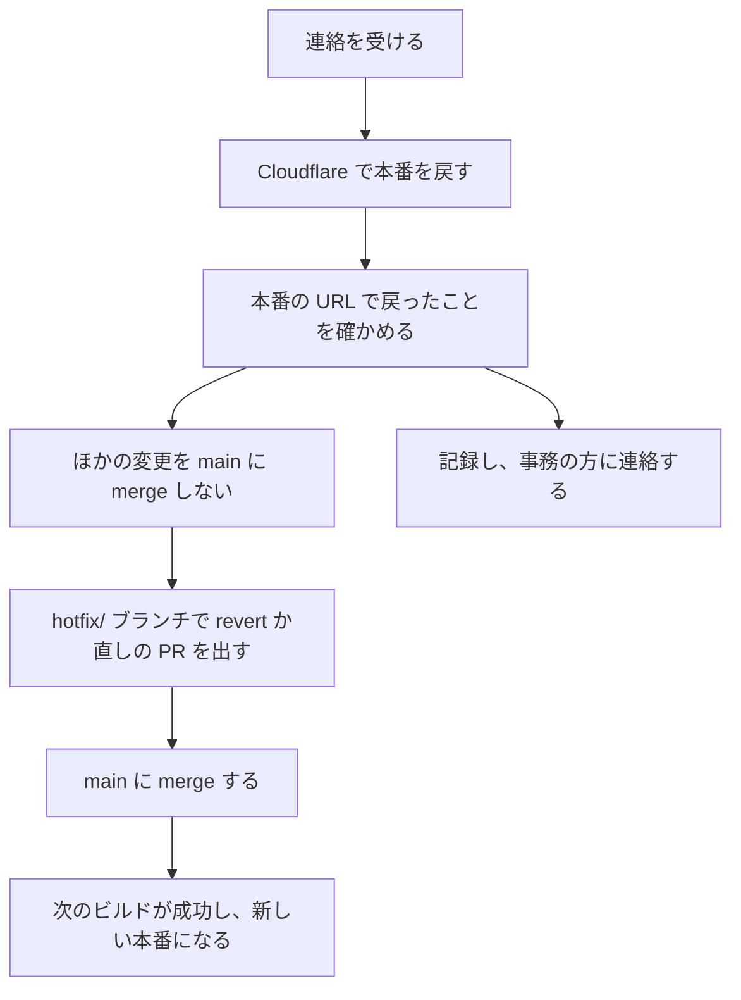

# 手順書：本番を元の状態に戻す（大久保向け）

誤って公開した、または本番が壊れたときに、Cloudflare Pages で本番を直前の正常なデプロイへ戻す手順です。
戻すのは配信だけで、GitHub の `main` は巻き戻りません。戻したあとに GitHub での後始末が要ります。

## いつ使うか

- 内容や写真を誤って公開した
- 公開した変更のせいで、本番の表示や動作が壊れた

どちらも、事務の方から連絡を受けたら、原因の調査より先に戻します。調査は戻したあとにします。

## 前提

- Cloudflare の村田宝飾名義のアカウントに、Pages を編集できるロール（`Workers Platform Admin` 以上）で入れること。メンバーの招待ができるのは Super Administrator だけなので、権限が足りないときは Super Administrator に頼む
- プロジェクト名は `murata-corporate-site`、本番のブランチは `main`

## 全体の流れ

## Cloudflare で戻す

1. Cloudflare のダッシュボードで「Workers & Pages」を開き、`murata-corporate-site` を選ぶ
2. 「Deployments」を開き、「All deployments」を選ぶ
3. 戻したいデプロイを探す。誤った変更が入る直前の、本番（Production）のデプロイを選ぶ。戻し先にできるのは、ビルドに成功した本番のデプロイだけで、プレビュー（`staging`）のデプロイは選べない
4. そのデプロイの右にある「…」メニューから「Rollback to this deployment」を選び、確認の画面で確定する
5. すぐに切り替わる。本番の URL（https://www.murata-jewelry.co.jp 。切り替え前は `murata-corporate-site.pages.dev`）を開いて、誤りが消えていることを確かめる

戻したあとでも、同じ画面からそれより新しいデプロイへ戻し直せます。

## 戻したあとに GitHub でやること

ロールバックは配信を切り替えただけなので、問題の変更は `main` に残っています。
このまま次の変更を `main` に merge すると、そのビルドが新しい本番になり、問題が再び出ます。
そのため、次の順に進めます。

1. 修正が `main` に入るまで、ほかの変更を `main` に merge しない。事務の方や Codex が進めている公開の依頼があれば、待ってもらう
2. 問題の変更を打ち消す PR（revert）か、直しの PR を出す。ブランチ名は `hotfix/` で始める。`hotfix/` のブランチから大久保が出した PR だけは、`staging` を通さずに `main` へ入れられる（必須チェック `staging-verified` の例外）。ほかの必須チェックは通常どおり動くので、PR を出したら `@codex review` とコメントし、Codex のレビューも通す
3. 必須チェックが通ったら `main` に merge する。ビルドが成功すると、それが新しい本番になる
4. 本番の URL で、直った状態であることを確かめる

## 記録すること

戻したら、次の4点を残します。

- 戻したデプロイ（commit の SHA）
- 戻した人
- 戻した理由
- 戻した日時

## 事務の方への連絡

次の3点を伝えます。

- 本番を戻したこと（戻した日時を添える）
- 修正が `main` に入るまで、本番への公開を待ってほしいこと
- 修正が入って本番が元に戻ったこと（入ったとき）
